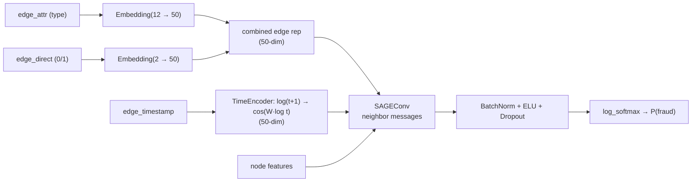

<br/>

# Introduction and Motivation

Graphs present a natural way of modelling a large variety of phenomenon. These include social networks, financial networks, e-commerce activities and so on. GNNs can seamlessly model interactions between various users, and their activities like transactions, reviews, and posts.

In most networks, malicious users pose a great threat to the stability and experience of other normal users. Malicious users can enter a network, produce fraudulent information, participate in fraudulent transactions and facilitate other harmful activities.  Our aim is to discover these malignant users in the graph through their node features and local graph structure. We reduce the problem of Fraudulent Activity Recognition into a node-level classification task. 

<br/>

Financial fraud rarely happens in isolation. Fraudsters operate in rings, move money through intermediary accounts, and leave traces not in any single row, but in the *structure* of transactions. This is exactly the regime where graph modeling wins: a suspect's risk depends on the risk of the accounts it transacts with.

<br/>

This project walks through a fraud-detection system I built on the DGraphFin dataset released by Xinye and hosted on OpenI. The task is node-level fraud classification on a large, heterogeneous financial transaction graph. The core idea is simple: a graph captures who transacts with whom, which a pure tabular model never sees — but a well-engineered tabular model still carries information the graph can under-use. So I built two branches, a time-aware GraphSAGE GNN and an XGBoost model over hand-crafted features and blended their probabilities.

# Datasets and Problem Definition

DGraph-Fin is a directed, unweighted dynamic graph that represents a social network among users of Finvolution Group. In this graph, a node represents a Finvolution user, and an edge from one user to another means that the user regards the other user as the emergency contact person. An illustrative overview of dataset is provided below.

Each node in the graph is a user of FinVolution, and edges in the graph between two users (u and v) represent user u designating user v as their emergency contact. This is a directional graph between the users with 3,700,550 nodes and 4,300,999 edges. Nodes in the graph are classified as foreground nodes and background nodes. Foreground nodes are the ones that labeled as normal (Class 0) and fraud (Class 1), which are also the nodes of our prediction task. Background nodes, on the other hand, are irrelevant to the task but play an important role in maintaining the connectivity of the graph. There are 1,210,092 users labeled as Normal and 15509 users labeled as Fraud. The dataset also provides 17 anonymous features based on user demographics. We use the default train/validation/test split provided with the dataset, with a 70/10/20 train-validation-test split ratio.

I frame the problem as graph node binary classification:

- **Nodes** = accounts (borrowers / transaction entities).
- **Edges** = interactions, each carrying an edge type and a timestamp.
- **Label** = fraud (1) or normal (0), per node.
- **Metric** = ROC-AUC, evaluated on a held-out test set of nodes.

The engineering goal is to produce a probability for every node, then threshold or rank. Fraud is heavily imbalanced, so AUC — which is rank-based — is the natural metric.


DGraphFin is large and messy in exactly the ways that make production anti-fraud hard:

| Property           | Value                              |
| ------------------ | ---------------------------------- |
| Nodes              | ~3.7M                              |
| Edge types         | 11                                 |
| Edge features      | type + timestamp                   |
| Node features      | 17 raw + engineered                |
| Label distribution | heavily imbalanced (fraud is rare) |

The main challenges I had to solve:

1. **Scale.** ~3.7M nodes mean full-batch GNN training does not fit in GPU memory. Scaling GNN to massive dataset is an indispensable factor to be taken into account.
2. **Class imbalance.** It's not uncommon in finance data. Fraud is rare; naive training degrades badly. I used focused negative sampling.
3. **Label leakage.** DGraphFin ships `train/valid/test_mask` as over all nodes. Neighbor-label statistics (e.g. "what fraction of my neighbors are fraud") are extremely predictive but leak information for transductive training.
4. **Timestamps.** Edges have time, and when someone transacts (sudden bursts, first/last activity) carries signal beyond raw edge counts. How to fully utilize temporal information and make the model incorporate this feature is tricky.

# Feature Engineering

Feature engineering matters twice here: it feeds the XGBoost branch directly, and it also augments the GNN's node features. All of it is implemented with **`torch_scatter` reduction ops** (no Python loops over the graph), which keeps it fast on 3.7M nodes.

**Structure features**

- In-degree and out-degree — the simplest and still among the strongest signals.

**Data-quality features**

- The first 17 raw features use `-1` as a missing-value sentinel. I added a count of missing values per node and **filled `-1` with 0** so downstream operations are numerically stable.

**Edge-attribute aggregations**

- Per-node mean of edge types, split by source vs. destination.
- One-hot counts of each of the 11 edge types, summed over incoming/outgoing edges — a rich profile of *how* a node interacts.

**Timestamp features**

- `max` / `min` / `mean` / `diff` of edge timestamps, from source, destination, and both perspectives.
- The **edge type of the node's earliest and latest edge** — encoding *what kind* of activity started and ended a node's history.

**1-hop neighbor statistics**

- For each of the first 17 features: max, min, and mean over direct neighbors. This injects a shallow "neighborhood summary" into every node's feature vector without needing the GNN to rediscover it.

**Similarity**

- Cosine similarity between a node and its neighbors, summed — an effective proxy for local homogeneity.

### The tabular branch gets its own feature set

XGBoost should only see features that are **safe and per-sample independent**. Two things are deliberately excluded from the tabular set (`get_xgb_features` returns 68 dims):

- Neighbor **label** ratios (count of fraud neighbors) — clear leakage in transductive setting.
- One-hop *feature* summary statistics (the 51-d neighbor feature block) — these carry graph-message-passing information that is the GNN's job, and including them blurs the complementarity between branches.

The result is a clean 68-dimensional table: 17 raw + 2 degree + 1 missing count + 3 edge-attr means + 33 edge-type one-hot counts + 12 timestamp stats.


# GNN Model Design

The GNN is a **3-layer GraphSAGE** message-passing network with three design choices worth highlighting:



- **Edge-type and edge-direction embeddings.** Different transaction types (transfer, loan, repayment, …) and the *direction* of a transfer mean different things. The model learns a 50-dim embedding for each of the 12 edge-attr values and each of the 2 directions, then adds them into every message.
- **TimeEncoder.** Timestamps are transformed via `log(t+1)` then `cos(W · log t)`, mapping scalar times to a smooth 50-dim representation. This captures proximity in time — two edges at similar times produce similar encodings — without assuming a linear relationship.
- **Standard regularization.** BatchNorm, ELU, Dropout, and `log_softmax` on top, trained with NLL loss.


## 6. Training & Engineering

Training a GNN on 3.7M nodes requires care:

- **3-hop subgraph sampling.** For each training batch, I extract the `k=3`-hop subgraph around the batch nodes with `k_hop_subgraph`. This bounds memory while preserving each node's local receptive field (3 hops ≈ 3 message-passing layers).
- **Focused negative sampling.** Each step samples `3 × |positives|` negative nodes, keeping the mini-batch balanced instead of flooding the model with easy negatives.
- **Optimization.** AdamW with weight_decay, gradient clipping, and `expandable_segments` in `PYTORCH_CUDA_ALLOC_CONF` to tame memory fragmentation.
- **Batched full-graph inference.** Full-graph prediction is computed in chunks of 8192 nodes, storing probabilities on the **CPU** — the GPU only ever holds one 3-hop subgraph at a time. This is the trick that makes evaluation tractable.


## Tabular solution: XGBoost

The GNN alone leaves accuracy on the table; a strong tree model over good features closes much of it.

- **Features.** The 68-dim leakage-free tabular set from Section 4.
- **AutoML auto feature engineering.** I use [OpenFE](https://github.com/IIIS-Learning-Group/OpenFE) offline for quick feature combinations construction, then reuse the selected feature objects at inference. 
- **Top-100 selection.** When the feature count exceeds 200, I drop features by **XGBoost feature importance**, computed **only on the training split** to avoid leakage.
- **5-fold cross-validation.** Five XGBoost models, predictions averaged — a cheap variance reduction that reliably nudges AUC up.


We use a naive ensemble method to blend the prediction of GNN and tree model. We use a fixed weighted average of class-1 probabilities:

```text
P_final = 0.3 × P_GNN + 0.7 × P_XGBoost
```

| Model                            | Test AUC        |
| -------------------------------- | --------------- |
| official GCN baseline | 0.70 |
| GraphSAGE (single model)             | 0.85 |
| XGBoost                      | 0.82 |
| Ensemble (0.3 GNN + 0.7 XGB) | 0.86        |

The 0.7 weight on XGBoost reflects that, on this dataset, a tree ensemble with well-engineered tabular features are stronger than GNN. But the GNN contributes non-redundant structural signal that the blend captures. 

# Conclusions and key takeaways

- The biggest lesson is that a heterogeneous graph and a well-engineered tabular model are *complementary*. The GNN squeezes out structural signal (community, local topology) that trees can't see; XGBoost exploits per-node statistics and timing that the GNN under-weights. A trivial 0.3/0.7 average of the two beat either alone.
- As is expected, GNN layers suffer from over-smoothing, where stacking layers don't help improving performance. Here we use a sequential of 3 GNN layers.
